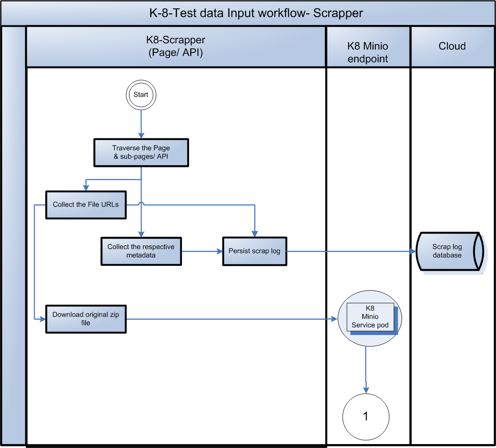
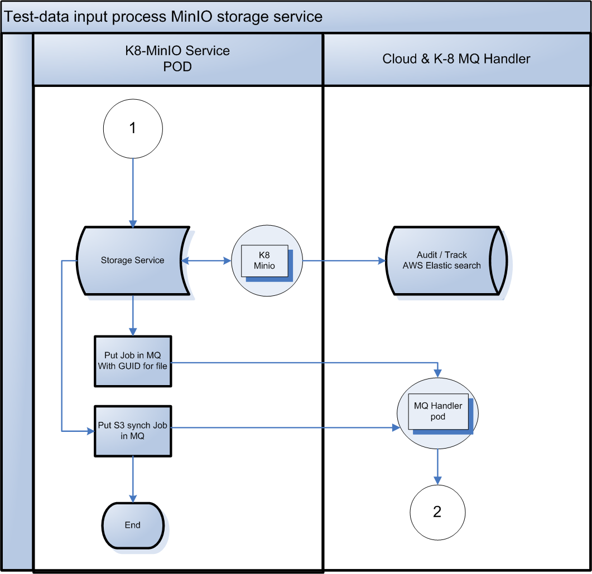
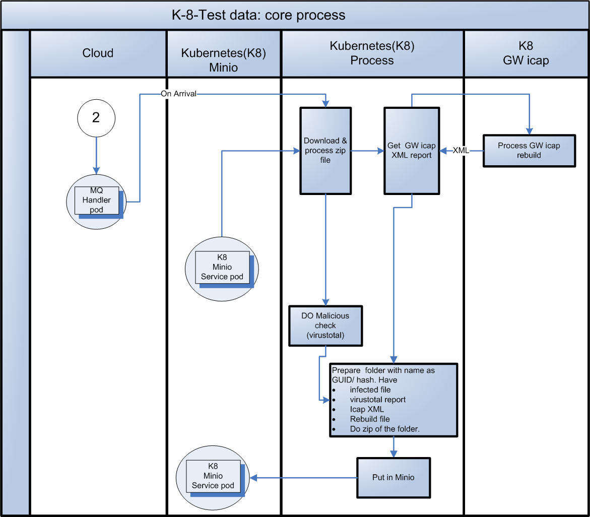
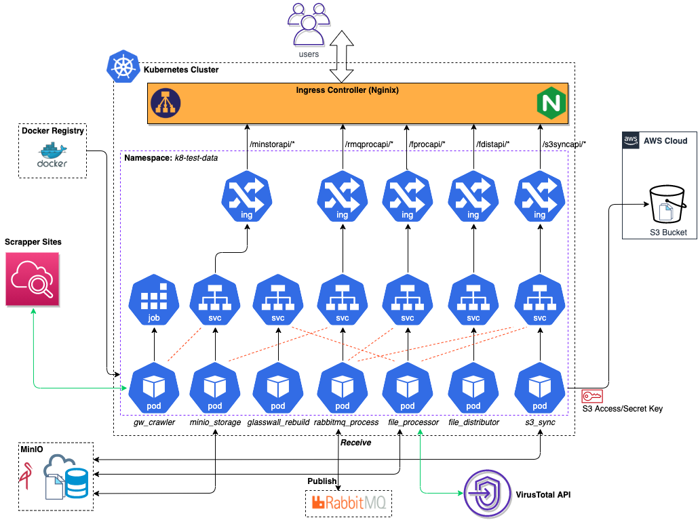

# k8-test-data

If you are working on this project via Upwork, see also our [Upwork Rules of Engagement](https://github.com/filetrust/Open-Source/blob/master/upwork/rules-of-engagement.md)

### Project brief

**Objective**: Test data for GW Rebuild engine running in the multiple K8 Projects

- In order to effectively test the K8 projects, we need a sufficient test data file, that is able to simulate different type of threats and covering all file types supported by Glasswall. Key activities to be covered are 
  - GitHub repo with thousands of test files to be created. 
  - Proceed with caution when handling live malware files.
  - The file types should cover all supported file types by Glasswall (Refer https://glasswallsolutions.com/technology/ or https://file-drop.co.uk/ )
  - Sample files can be sourced from Glasswall public files(https://engineering.glasswallsolutions.com/docs/products/cloud-sdk/sample-files/ , https://github.com/filetrust/GW-Test-Files , )
  - Glasswall private files (https://github.com/filetrust/malicious-test-files  , https://github.com/filetrust/sdk-eval-toolset/tree/master/test  and  https://console.aws.amazon.com/s3/buckets/jp-testbucket-1/?region=eu-west-2) 
  - Dynamic generation of files , based on programmatically modifications of content, structure and capabilities.

- The final objective is to be able to to support - 4 Million files with an average file size of 10 Mbs. However at start we will start with Github repo. 

**Process Flow & Architecture**  
  - For each type of work, kubernetes (K8)  PODs of that type will be created. The orchestration of "POD type" clusters through Event driven architecture will complete  the process flow.
  - All the kubernetes resources respective to this project will be created under a namespace called "***k8-test-data***" to isolate from other project deployments.


  - **K8 - Scrapper Pod**
  
     
     - The original zip file will be downloaded by scrapper along with metadata.
     - Persist the scrap log in cloud.
     - Base scrapper should have batch scrapping functionality.
     - Push the downloaded zip file to MinIO  service with GUID as filename of the zip file.
     - This module can be deployed as a CronJob (batch process) resource in Kubernetes cluster, which can be scheduled to do crawling job at specific timings. (**TBC**: whether to deploy as a Service to be scheduled externally.)
     
  - **K8 MinIO Storage Pod**
   
      
     - The original zip file gets downloaded and metadata collected like URL, date created etc.
     - Communicates with MinIO docker and stores the file.
     - Put the Job in Rabbit MQ via MQ handler POD with GUID as filename for file processing by K8-core POD..
     - Put the S3 synchronization job in MQ.
     - Minio and rabbitmq can be deplyoed under a common namespace (say ***k8-common***) that can even be used by every other projects within Glasswall.
     
  - **K8 core POD**
  
      
     - On arrival in MQ, download the original zip file from Minio. Unzip it.
     - Create a folder, with name as **GUID or hash**.
     - Do malicious check from virustotal. (will be handled through K8 POD type 2.1 )
     - Send the file to Glasswall Icap rebuild service. (should be in  K8 POD )
     - Download the virustotal report.
     - Download GW icap xml report and rebuild file
     - Make a zip of the folder with same name as folder name.
     - Put the Job in Rabbit MQ with GUID as filename.
     
  -**MinIO - S3 Synchronization POD**
  
  
     - Non K-8 activities or create another K8 POD. This will long running as the queue will built up.
     
  - **K8 File Distribution POD**
     - This Kubernetics POD will host distribution API, which will cater to all the client requests to provide the file from Minio service. 
  
Malware Public Repositories ( Proceed with caution when handling live malware) :

**VirusShare**: https://virusshare.com/

  - Requires login (free)
  - ZIP password is “infected"

**The Zoo**: https://github.com/ytisf/theZoo

  - Look in malwares/Binaries subdirectory
  - ZIP password is “infected"

**Malshare**: https://malshare.com

  - Immediate access - register to get an API key allowing download of 1000 samples/day

**Das Malwerk**: http://dasmalwerk.eu/

  - Immediate access
  - ZIP password is “infected”

Public malware reference - https://cyberlab.pacific.edu/resources/malware-samples-for-students
Note :  http://contagiodump.blogspot.com/ in above public reference not implemented since it is paid service and password for malware zip is not availble

## Build

* Set .env file in each service(refer env.zip)

`docker build -t rabbit-mq:1.0 rabbitmq`

`docker build -t scrapyd gw_crawler/malicious_file_crawler`

`docker build -t glasswallcrawler:1.0 gw_crawler`

`docker build -t k8-file-processor file_processor`

`docker build -t k8-file-distribution file_distribution`

`docker build -t glasswall-rebuild  glasswall_rebuild`

`docker build -t k8-s3-sync s3_sync`

`docker build -t storage:1.0 storage`


## Run
`docker-compose up -d scrapyd`

`docker-compose up -d rabbitmq`

`docker-compose up`

## Run security check

`python3 -m bandit --skip B605 -ll -r .`


## Kubernetes Deployment
### Deployment High-Level Architecture


### K8 Deployment Steps
a. Build docker images and push to the registry.  
      Go to each module and run the following script inside the _dist/scripts/_

  ```./docker_build.sh```

  (Make sure to update the docker registry and docker version)

b. Go to Kubernetes master node (K8 Cluste Setup is ongoing, update the Master Node details when it is ready), and execute the following script inside the _dist/scripts/_ for each module,
  
  ```./k8s*deploy.sh```

  (Make sure to update the env settings, and the docker image as per the step 1 in _dist/k8s/k8s*deploy_def.yml_).  

## K8 ELK Stack Centralized Logging
Setup a centralized logging system to collect logs from Pods running in a Kubernetes cluster, to send the log data into Elasticsearch, and to finally visualize the log data in Kibana using various interactive real-time visualizations. This can be achieved by setting up Elasticsearch, Filebeat and Kibana in Kubernetes.

In order to deploy this setup, grab the entire folder _k8_elk_logging_, and execute the following script:
```./dist/scripts/k8s_elk_deploy.sh```
